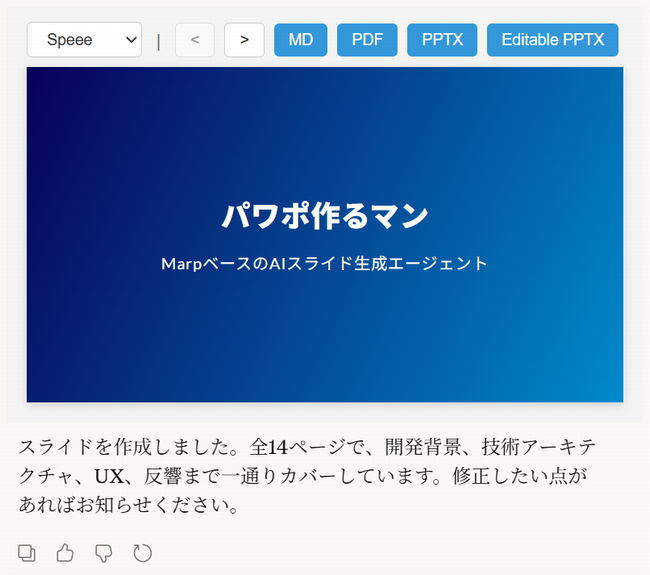

# パワポ作るマンを実験的にMCP Apps化したやつ

みのるんさんの[パワポ作るマン](https://github.com/minorun365/marp-agent)をMCP Apps化した実験的プロジェクトです。

Claude Desktop AppとClaude.aiで動作確認済み。

## 機能

- 自然言語によるスライド生成（スキルも併用）
- インタラクティブなプレビュー
- 3つのテーマ (`speee`, `border`, `gradient`)
- 4つのダウンロード形式（Markdown、PDF、PPTX、編集可能なPPTX）

### 使用例

## 使い方

### MCPサーバーの設定

Claude Desktop App/Claude.aiのカスタマイズ画面で、新しいカスタムコネクタとして `https://pawapo.iwamot.com/mcp` を追加します。認証は不要です。

ただし、このリモートMCPサーバーは予告なく仕様変更・停止・終了する可能性があります。

### スキルの設定

https://pawapo.iwamot.com/skill.zip をダウンロードし、Claude Desktop App/Claude.aiのカスタマイズ画面で、新しいスキルとしてアップロードします。

## MCPサーバーの構成

### ツール

| ツール | 説明 |
|--------|------|
| `validate_slide` | スライドのオーバーフローチェック |
| `export_pdf` | PDF出力 |
| `export_pptx` | PPTX出力（編集可能オプションあり） |

### インタラクティブツール

| ツール | 説明 |
|--------|------|
| `preview_slide` | スライドのプレビュー表示 |

## MCP Apps開発者向けメモ

- インタラクティブツールのHTMLサイズが大きいと、カスタムコネクタ経由ではUIが表示されないことがあった。本プロジェクトでは marp-core を [esm.sh](https://esm.sh/) (CDN) から読み込むことで解決した

## ライセンス

MIT
